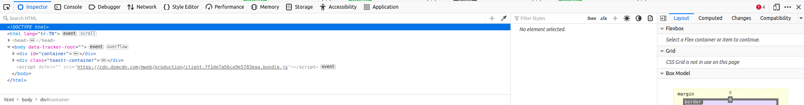

# Web_Scrapping
This is a little program that introduce web scrapping.
## Goal
Main purpose is to scrap names of products from internet market.
## Pre requests
you need to install libraries:
- BeautifulSoup     ``sudo pip install bs4``
- Selenium          ``sudo pip install selenium``
- Firefox Webdriver ``sudo apt-get install firefox-geckodriver `` 

## At First 
we need to choose internet market. I prefer Trendyol.com. Then we need to copy url of page which interests us.
In this code I use this:

``https://www.trendyol.com/sr?q=paten&qt=paten&st=paten&os=1&pi=1``

By right clicking a page, then clicking *inspect* you will see a new tab like this:


Then by navigating a cursor you will see that every row is related to image boxes and also highlightes them. By expanding prefered boxes you can  reach to interested data. 

In this image you can see that we have rows ( classes ) of each product. By expending them, you can reach their detailes like name, price, etc. I remind that our goal is to find product names. It looks like this:
```html
<span class="prdct-desc-cntnr-name hasRatings" title="Işıklı Ayarlanabilir Slikon Teker Metal Gövde Paten">Işıklı Ayarlanabilir Slikon Teker Metal Gövde Paten</span>
```
we found every data we need.

## Code
```python
from selenium import webdriver      #Importing Libraries
from bs4 import BeautifulSoup       

driver = webdriver.Firefox()        #Defining Webdriver

for i in range(3):                  #Page scrolling loop
    link=("https://www.trendyol.com/sr?q=paten&qt=paten&st=paten&os=1&pi=" + str(i+1))      #Doing string addition to turn pages
    driver.get(link)                          #Definding URL

    content = driver.page_source
    soup = BeautifulSoup(content, "html.parser")                      #Definfing site parser
    products = soup.find_all('div', class_="p-card-wrppr add-to-bs-card")             #In this row we search a class which include all products classes 
    for products in products:                                                #Then doing loop for every product class
        name = products.find("span", class_="prdct-desc-cntnr-name hasRatings" )  #Searching for name string in product class
        list = str(name).split('"')                                              #Then by converting name to string, we split it and append to list
        if "None" not in list :                                                  #We do not print,if list include "None"
            print(list[3])

```


